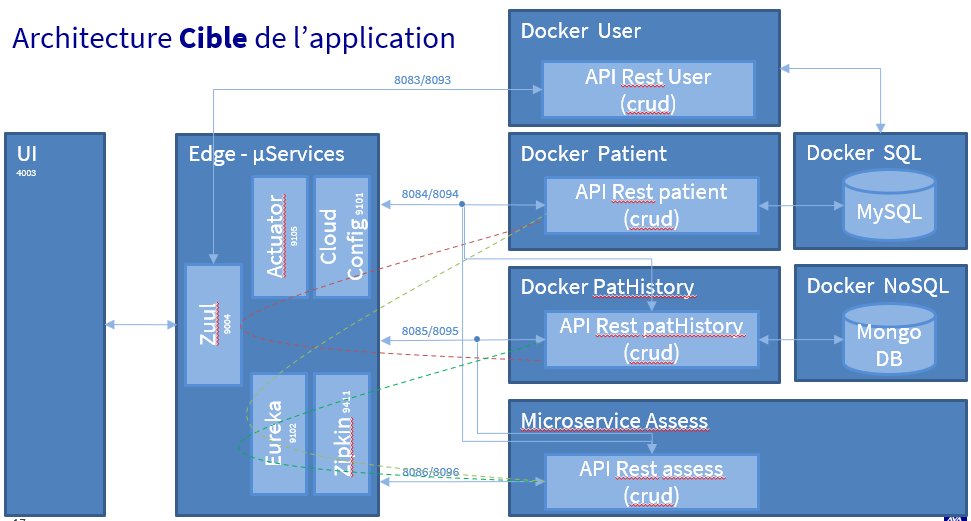

# SoftwareAcademy-P9-User
Micro-service USER manage users authentification on MEDISCREEN Application. 

This microservice use SPRINT BOOT and MySQL

# Getting Started
EndPoint for global application  : 
* http://localhost:4200

# Prerequis
For USER microservice
* Java 1.8 or later
* Spring Boot 2.2.6
* MySQL
* Docker 2.5.0.0 or later (optional)

For Global application
* Java 1.8 or later
* MySQL
* MongoDB
* Spring Boot 2.2.6
* Docker 2.5.0.0 or later (optional)
* Angular
* Zipkin
* Eureka
* Config server

## Installation
Check PatientV2 Readme.md for global installation 

###Docker image construction in project directory :
docker build --build-arg JAR_FILE=target/*.jar -t p9-user .

### Docker execution if docker-compose is not use
docker run -p 8083:8083 --name USER p9-user

### Database installation
on MySQL
* execute script CreateDatabase.sql to create database « mediscreen_prod » and create user « mediscreen »
* with user mediscreen_prod, exécute script create.sql to create tables patient and user
* execute script data.sql present in ressource if PatientV2 for initiate user table

## URI
### signin
* directly : GET http://localhost:8083/signin?username=xxxx&pwd=yyyy
* With zuul : GET http://zuul:9004/microservice-user/signin?username=xxxx&pwd=yyyy

### create user
* directly : POST http://localhost:8083/signup?username=xxxx&pwd=yyyy
* With zuul : POST http://zuul:9004/microservice-user/signup?username=xxxx&pwd=yyyy

### update user
* directly : PUT http://localhost:8083/user?username=xxxx&pwd=yyyy
* With zuul : PUT http://zuul:9004/microservice-user/user?username=xxxx&pwd=yyyy

### delete user
* directly : DEL http://localhost:8083/user?username=xxxx&pwd=yyyy
* With zuul : DEL http://zuul:9004/microservice-user/user?username=xxxx&pwd=yyyy

## Divers
Global architecture : 
